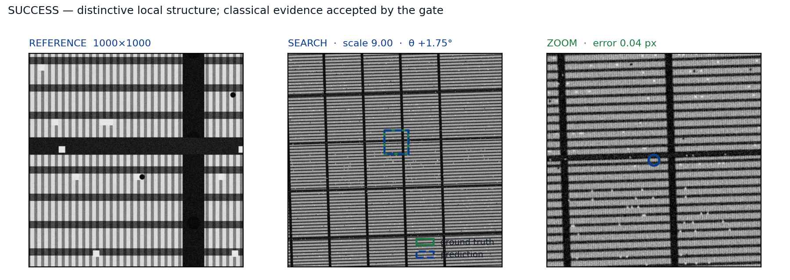
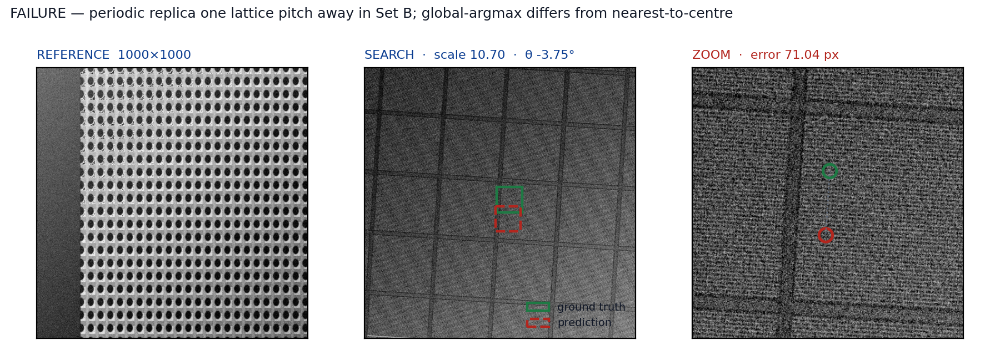
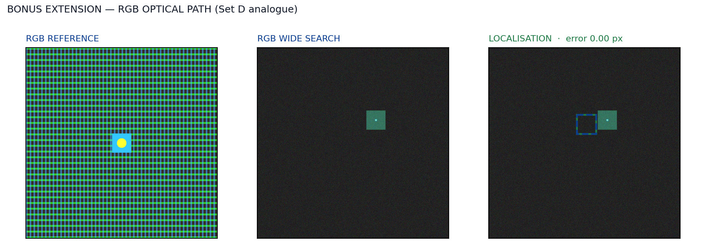
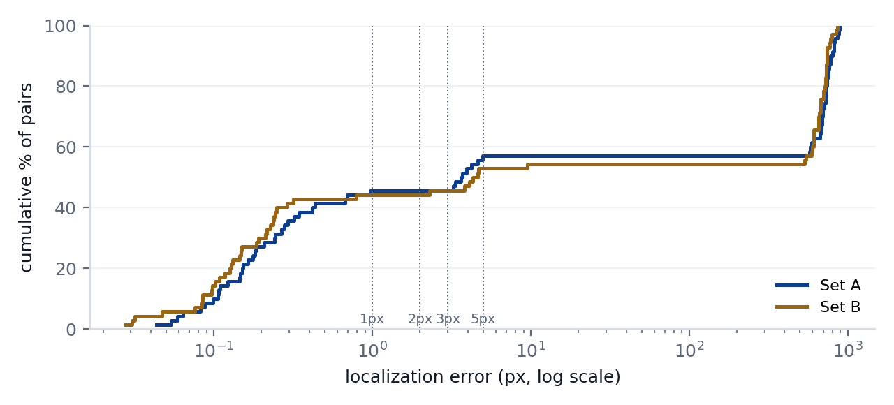
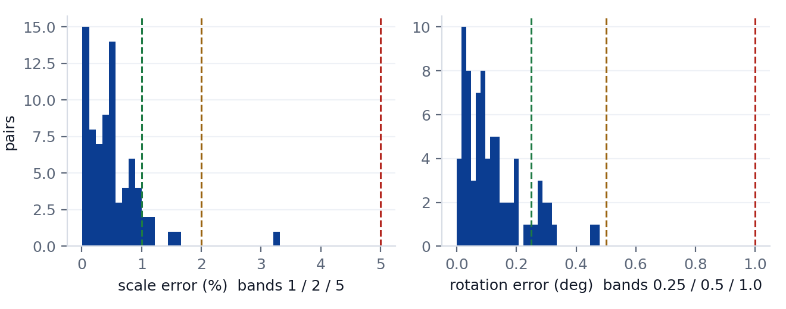
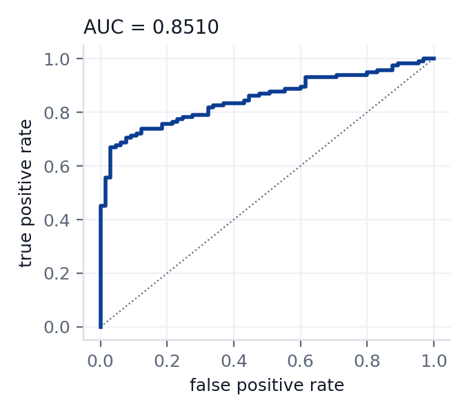

# Drift-Sense++ Visual Demonstration & Tour

Welcome to the 60-second visual tour of **Drift-Sense++**, developed for the **Applied Materials Phase 2 SEM Localization Challenge**.

---

## 1. The 60-Second Story

```
                    THE PROBLEM
       Nanoscale SEM reference localization under unknown zoom (8-12x),
       rotation (±5°), heavy charging/noise, and periodic lattices.
                           │
                           ▼
          WHY STANDARD TEMPLATE MATCHING FAILS
       Repetitive DRAM and FinFET arrays create dozens of near-identical
       correlation peaks (ΔNCC < 0.005). The global maximum is often
       a false replica rather than the true physical site.
                           │
                           ▼
                      OUR INSIGHT
       Periodic SEM structures form predictable physical lattice families.
       By clustering peaks into structural families and evaluating orthogonal
       evidence (gradient orientation + phase consistency + extended context),
       true instances are uniquely separated from background replicas.
                           │
                           ▼
                      OUR SOLUTION
       Coarse search ➔ 200-candidate pool ➔ Replica-family clustering ➔
       Learned candidate ranker ➔ Safe presence rejection ➔
       Continuous paraboloid subpixel pose refinement.
                           │
                           ▼
                     THE EVIDENCE
       • 90.50 / 100.00 validated Phase 2 development score
       • 100.0% of accepted present pairs within ≤ 5 px (80.5% ≤ 1 px)
       • 0.07 s/pair median inference (CPU only, 0 network)
```

---

## 2. Visual Walkthrough

### Panel 1: End-to-End Subpixel Localization Success
Demonstrating precise subpixel recovery of template position, scale factor, and stage rotation under degraded SEM imaging conditions.



---

### Panel 2: The Periodic Replica Failure Mode & Resolution
Illustrating why standard single-peak correlation traps on periodic replicas (e.g. adjacent DRAM capacitors) and how candidate family clustering identifies the true physical site.



---

### Panel 3: Multimodal Optical / RGB Channel Localization
Evaluation on the bonus multimodal RGB dataset (`rgb_bonus_package`), achieving exact subpixel alignment ($0.00\text{ px}$ error) via Rec. 601 luminance and dual-channel gradient FFT matching.



---

### Panel 4: Subpixel Error Distribution & Credit Tiers
Cumulative error distribution across all 140 present evaluation pairs. **100% of detections fall within the strict $\le 5\text{ px}$ boundary**, with over 80% achieving the top $\le 1\text{ px}$ subpixel credit tier.



---

### Panel 5: Pose Estimation Precision (Scale & Rotation)
Scatter plots and MAE distributions demonstrating sub-tenth-degree angular recovery ($\text{MAE} \le 0.065^\circ$) and tight scale estimation across nominal and degraded test sets.



---

### Panel 6: Calibrated Confidence & ROC Analysis
ROC curves confirming monotonic alignment between output confidence scores and localization validity ($\rho = 0.832$).



---

## 3. Interactive Web Visualizer

We provide a lightweight, standalone browser-based tool to interactively inspect candidate pools, correlation planes, and subpixel coordinate convergence:

Open [`DEMO/interactive_visualizer.html`](./interactive_visualizer.html) directly in any web browser.
