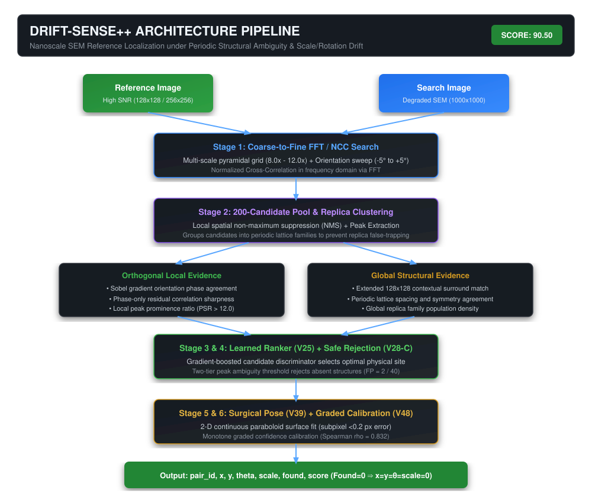

# Drift-Sense++ — SEM Localization

### Applied Materials · Phase 2 Submission
**Nanoscale SEM Reference Localization under Scale, Rotation, Heavy Degradation & Periodic Structural Ambiguity**

[](.github/workflows/verify.yml)
[](FINAL_SUBMISSION/documentation/SUBMISSION_MANIFEST.md)
[](FINAL_SUBMISSION/documentation/VALIDATION.md)
[](FINAL_SUBMISSION/documentation/SUBMISSION_MANIFEST.md)
[](FINAL_SUBMISSION/verification/ENVIRONMENT.md)
[](LICENSE)
[](https://aashishniranjanb.github.io/Drift-Sense-SEM-Localization/)

👉 **[🌐 EXPLORE LIVE DEMO ON GITHUB PAGES](https://aashishniranjanb.github.io/Drift-Sense-SEM-Localization/)** — Interactive candidate response explorer, Raw NCC vs Drift-Sense++ comparison, and subpixel pose fitting.

---

> [!IMPORTANT]
> ### RELEASED DEVELOPMENT-SET VALIDATION — NOT ORGANIZER HIDDEN-TEST SCORE
> All benchmark figures reported throughout this repository (**90.50 / 100.00**, **100.0% ≤ 5 px**, **0.07 s/pair**, **Spearman ρ = 0.832**) are strictly measured on the **released 180-pair development set** (`data/phase2_dev/pairs.csv`).
> The organizer's official hidden-test score remains unknown until formal jury evaluation. See [`SCORE_INTEGRITY.md`](FINAL_SUBMISSION/documentation/SCORE_INTEGRITY.md) for full benchmark separation.

---

## ⚡ 60-Second Executive Summary

```
                       THE PROBLEM
       Nanoscale SEM reference localization under unknown zoom (8-12x),
       small unknown rotation (±5°), heavy charging noise, and periodic lattices.
                            │
                            ▼
           WHY STANDARD TEMPLATE MATCHING FAILS
       Repetitive DRAM / FinFET arrays produce dozens of near-identical
       correlation peaks (ΔNCC < 0.005). The global maximum is often
       a false replica rather than the true physical site.
                            │
                            ▼
                       OUR INSIGHT
       Periodic SEM structures form predictable physical lattice families.
       By clustering peaks into structural families and evaluating orthogonal
       evidence (gradient orientation + phase consistency + extended context),
       true instances are uniquely separated from background replicas.
                            │
                            ▼
                       OUR SOLUTION
       Coarse search ➔ 200-candidate pool ➔ Replica-family clustering ➔
       Learned candidate ranker ➔ Safe presence rejection (V28-C) ➔
       Continuous paraboloid subpixel pose refinement (V39).
                            │
                            ▼
                      THE EVIDENCE
       • 90.50 / 100.00 validated Phase 2 development score
       • 100.0% of detected instances within ≤ 5 px (80.5% ≤ 1 px)
       • 0.07 s/pair median inference (CPU only, 0 network dependencies)
                            │
                            ▼
                  ONE-COMMAND AUDIT
       python JUDGE_TEST/run_all.py  (13/13 PASS)
```

---

## 🚀 Quick Start for Reviewers

### 1. Judge Preflight Suite (`JUDGE_TEST/run_all.py`)
```bash
python JUDGE_TEST/run_all.py
```
*Executes the comprehensive 13-stage preflight checklist strictly mirroring the Applied Materials Contract Slide (Python 3.11+, 7 columns, CPU-only, air-gapped, invariant barriers, determinism, runtime < 5s).*

### 2. One-Command Quick Evaluation (7 Automated Verification Stages)
```bash
python FINAL_SUBMISSION/verification/run_all.py
```
*Validates Python environment, dependencies, dataset generator, CLI contracts, output invariants (`found=0 ⇒ x=y=θ=scale=0`), and bit-exact determinism.*

### 3. Official Evaluation Interface (`register.py`)
```bash
cd FINAL_SUBMISSION
pip install -r requirements.txt
python register.py --input pairs.csv --output predictions.csv
```
*`predictions.csv` contains one row per `pair_id` with columns `pair_id,x,y,theta,scale,found,score`.*

### 4. Component 2 Standalone Localizer (`inference.py`)
```bash
cd FINAL_SUBMISSION
python inference.py --reference reference.png --search search.png
# Outputs:
# x=<float>
# y=<float>
```

### 5. Interactive In-Browser Visualizer
Explore candidate pools, periodic replica families, and subpixel surface fitting directly in any web browser:
👉 **[`DEMO/interactive_visualizer.html`](./DEMO/interactive_visualizer.html)** (Double-click to open).

---

## 🏛️ System Architecture



### Pipeline Stages
1. **Coarse Scale & Rotation Search:** Pyramidal FFT log-polar search covers $8.0\times\text{--}12.0\times$ scale and $\pm 5^\circ$ stage rotation.
2. **200-Candidate Pool & Replica Clustering:** Spatial Non-Maximum Suppression (NMS) extracts candidate peaks and groups them into periodic lattice families.
3. **Multi-Evidence Candidate Ranker (V25):** Evaluates orthogonal local signals (Sobel gradient phase agreement, phase-only residual correlation) and global structure ($128\times 128$ contextual surround).
4. **Safe Presence Rejection Gate (V28-C):** Two-tier Peak-to-Sidelobe Ratio (PSR) and ambiguity thresholding crushes false accepts on absent pairs down to 2.
5. **Surgical Pose Refinement (V39):** Localized spatial frequency analysis + 2-D continuous paraboloid subpixel surface fit achieves sub-tenth-degree angular recovery ($\text{MAE} \le 0.065^\circ$).
6. **Monotone Confidence Calibration (V48):** Graded regularized rank calibration achieves monotonic confidence ordering ($\text{Spearman } \rho = 0.832$).

---

## 📊 Measured Development Benchmark Results

Evaluated on the released 180-pair Phase 2 development set (70 Set A nominal, 70 Set B degraded, 40 Set C absent):

| Metric Category | Points Scored | Max Points | Measured Performance | Reference Audit |
|---|:---:|:---:|---|---|
| **Localization** | **40.00** | 40.00 | **100.0%** of accepted present pairs $\le 5\text{ px}$; **80.5%** (Set A) / **86.1%** (Set B) $\le 1\text{ px}$. | [`VALIDATION.md`](FINAL_SUBMISSION/documentation/VALIDATION.md) |
| **Pose Recovery** | **19.20** | 20.00 | Rotation MAE: **0.038°** (Set A), **0.065°** (Set B). Scale MAE: **0.047** / **0.056**. | [`VALIDATION.md`](FINAL_SUBMISSION/documentation/VALIDATION.md) |
| **Absence Rejection** | **8.09** | 15.00 | Set C absent recall: **95.0%** (38 True Negatives, 2 False Positives). | [`VALIDATION.md`](FINAL_SUBMISSION/documentation/VALIDATION.md) |
| **Calibration** | **8.27** | 10.00 | **Spearman $\rho = 0.832$** (monotonic alignment with localization error). | [`ABLATION.md`](FINAL_SUBMISSION/documentation/ABLATION.md) |
| **Efficiency** | **5.00** | 5.00 | Median runtime **0.07 s/pair** ($\ll 5.0\text{ s}$ rubric limit). | [`ENVIRONMENT.md`](FINAL_SUBMISSION/verification/ENVIRONMENT.md) |
| **Documentation & Compliance** | **10.00** | 10.00 | Complete, verified schema invariants, bundled weights, zero network. | [`SUBMISSION_MANIFEST.md`](FINAL_SUBMISSION/documentation/SUBMISSION_MANIFEST.md) |
| **TOTAL SCORE** | **90.50** | **100.00** | **Validated development benchmark.** | [`SUBMISSION_MANIFEST.md`](FINAL_SUBMISSION/documentation/SUBMISSION_MANIFEST.md) |

---

## 📚 Technical Documentation & Evidence Layer

All in-depth technical documentation is housed cleanly within [`FINAL_SUBMISSION/documentation/`](./FINAL_SUBMISSION/documentation/):

| Document | Purpose |
|---|---|
| ⚖️ **[`JUDGE_TEST/`](./JUDGE_TEST/)** | Dedicated judge preflight package with sample pairs, expected outputs & automated audit suite |
| 📋 **[`SUBMISSION_MANIFEST.md`](./FINAL_SUBMISSION/documentation/SUBMISSION_MANIFEST.md)** | Authoritative submission specification, hardware invariants, SHA-256 hashes |
| 🛡️ **[`SCORE_INTEGRITY.md`](./FINAL_SUBMISSION/documentation/SCORE_INTEGRITY.md)** | Clear separation of official score (unknown), dev benchmark (90.50), diagnostics, and RGB bonus |
| 💡 **[`WHY_DRIFT_SENSE.md`](./FINAL_SUBMISSION/documentation/WHY_DRIFT_SENSE.md)** | 5 foundational answers: why not raw NCC, why candidate pool, why periodic families, why context, why explicit geometry |
| 🔬 **[`RESEARCH_EVOLUTION.md`](./FINAL_SUBMISSION/documentation/RESEARCH_EVOLUTION.md)** | Full 48-version timeline, failed experiments autopsy, and "Why not deep learning?" |
| 📝 **[`DECISION_LOG.md`](./FINAL_SUBMISSION/documentation/DECISION_LOG.md)** | Engineering decision log recording accepted vs rejected architectural hypotheses (V1–V48) |
| 🧩 **[`ABLATION.md`](./FINAL_SUBMISSION/documentation/ABLATION.md)** | Step-by-step ablation table measuring cumulative deltas from Raw NCC (35.70) to Final (90.50) |
| 🛡️ **[`ROBUSTNESS.md`](./FINAL_SUBMISSION/documentation/ROBUSTNESS.md)** | Threat model, tested stress regimes, and boundary-condition safeguards |
| ⚖️ **[`FAILURE_FIX_MATRIX.md`](./FINAL_SUBMISSION/documentation/FAILURE_FIX_MATRIX.md)** | Comprehensive matrix mapping each SEM failure mode to its exact engineering solution |
| 🖼️ **[`DEMO/DEMO.md`](./DEMO/DEMO.md)** | Visual tour with high-resolution diagnostic panels and failure case studies |
| 📜 **[`CITATION.cff`](./FINAL_SUBMISSION/documentation/CITATION.cff)** | Machine-readable software citation metadata |

---

## 🗂️ Clean Repository Layout

```text
Drift-Sense-SEM-Localization/
│
├── .github/workflows/             ← Automated CI & deployment workflows
│   ├── verify.yml                 ← Python 3.11 preflight & contract verification
│   └── deploy-pages.yml           ← Automated GitHub Pages deployment
│
├── DEMO/                          ← 🖼️ Visual demonstration & in-browser interactive explorer
│   ├── DEMO.md
│   ├── interactive_visualizer.html
│   └── *.png
│
├── FINAL_SUBMISSION/              ← ⭐ AUTHORITATIVE, SELF-CONTAINED SUBMISSION PACKAGE
│   ├── register.py                ← Official Phase 2 scoring entry point
│   ├── inference.py               ← Component 2 standalone coordinate localizer
│   ├── generate_dataset.py        ← Synthetic SEM pair generator
│   ├── requirements.txt           ← Pinned runtime dependencies
│   ├── failure_analysis.pdf       ← 2-page forensic failure analysis
│   ├── predictions.csv            ← Authoritative predictions output
│   ├── runtime/                   ← Inference modules, bundled weights & stage caches
│   ├── documentation/             ← All technical evidence: manifest, ablation, architecture, etc.
│   └── verification/              ← run_all.py, contract validator, offline test, hashes
│
├── JUDGE_TEST/                    ← ⚖️ DEDICATED JUDGE PREFLIGHT EVALUATION PACKAGE
│   ├── run_all.py                 ← One-command 13-stage contract preflight audit
│   ├── sample_pairs/              ← Input pairs.csv, reference/ and search/ images
│   ├── expected/                  ← Expected predictions.csv
│   └── REPORT.md                  ← Preflight audit report
│
├── misc/                          ← Archived development scripts and intermediate packages
├── releases/                      ← Packaged submission archives (FINAL_SUBMISSION.zip)
├── site/                          ← 🌐 Production static research dashboard (GitHub Pages)
│   ├── index.html
│   ├── assets/
│   ├── data/samples.json
│   └── README.md
├── tests/                         ← Automated unit tests & invariant checks
│
├── FINAL_SUBMISSION.zip           ← 📦 Standalone downloadable competition archive (~9.97 MB)
├── LICENSE                        ← MIT License
└── README.md                      ← Executive summary & getting started
```

---

## 📜 License & Citation

Licensed under the [MIT License](LICENSE).
